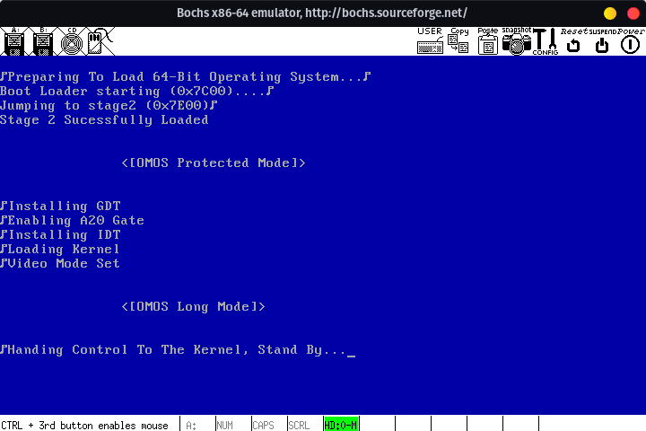

# MFOS
 <br />
<div id="top"></div>

## About The Project
My first OS written in Assembly to learn OS Development. I dedicate all my spare time to this project.

### Built With
* [osdev](https://wiki.osdev.org)
* [Brokenthorn](http://www.brokenthorn.com/Resources/)
* [CMake](https://cmake.org/)
* [NASM](https://nasm.us/)
* [BOCHS](https://bochs.sourceforge.io)

## Getting Started

### Prerequisites
Before any attempt is made to build, please do run the following script which updates and clones submodules:
```sh
./setup.sh
```
```dev.sh``` script will make sure you have all the needed packages required to build the OS:
```sh
./dev.sh
```
Additionally, you can install .NET by running:
```sh
./dotnet-install.sh
```